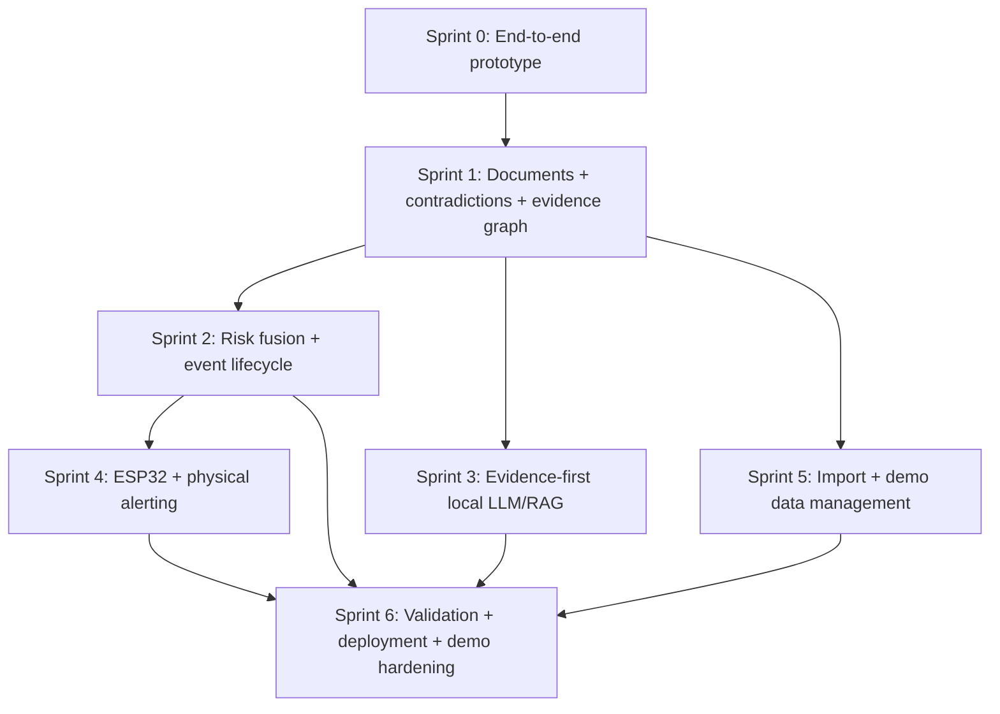

# TraceCare AI Roadmap

## Repository Baseline

This roadmap is based on the current repository state after Sprint 0, not only the original product brief.

Current Sprint 0 implementation:

- Backend: FastAPI, SQLAlchemy 2, Pydantic 2, SQLite.
- Frontend: React, TypeScript, Vite, native CSS, custom lightweight path router.
- Data model: `Patient`, `LabResult`, `ClinicalEvent`, `EvidenceLink`.
- Rule service: deterministic `RAPID_INCREASE` prototype rule for creatinine `0.8 -> 1.3 mg/dL` within 24 hours.
- Event lifecycle: `OPEN`, `ACKNOWLEDGED`, `RESOLVED`.
- Evidence: event-to-lab links with `PREVIOUS_VALUE`, `CURRENT_VALUE`, and `SUPPORTS`.
- Device: simulated adapter only.
- Seed data: P001, P002, P003 with synthetic creatinine labs.
- Tests: backend pytest coverage for health, seed idempotency, rule trigger/no-trigger, duplicate prevention, event actions, device state, and 404s.
- Docker: build-based backend/frontend images with a named volume for SQLite data.

Known Sprint 0 limits that affect future planning:

- No migration tool exists yet; schema changes currently rely on SQLAlchemy `create_all`.
- No document, clinical fact, action/audit, import, validation, RAG, or real device tables exist.
- No backend endpoint exists for seed/reset/import.
- Frontend has no route library, graph library, upload flow, or offline/retry state.
- API error shape currently appears under FastAPI `detail` for raised `HTTPException`.
- Docker Compose uses `localhost:8001` as the backend host port because local port `8000` may be occupied.

## Sprint Overview

| Sprint | Theme | Recommended Effort | Main Goal | Primary Deliverables |
|---|---:|---:|---|---|
| Sprint 0 | End-to-end prototype | Complete | Synthetic creatinine event workflow | Patients, labs, `RAPID_INCREASE`, evidence, acknowledgement/resolution, simulated device |
| Sprint 1 | Clinical documents, contradictions, evidence graph | 4-5 days | Add fixed-format synthetic documents and deterministic contradiction detection | `CONTRADICTION` events, source-linked facts, graph API, Cytoscape UI |
| Sprint 2 | Risk fusion and event lifecycle | 3-5 days | Combine event types into deterministic risk and add richer lifecycle/audit | risk service, timeout escalation, defer, action/audit trail, lifecycle UI |
| Sprint 3 | Evidence-first local LLM/RAG | 4-5 days | Add traceable local summaries with evidence packages and abstention | local LLM adapter, evidence package, citation checks, deterministic fallback |
| Sprint 4 | ESP32 and physical alerting | 3-5 days | Add USB Serial hardware adapter while preserving simulation | serial adapter, heartbeat/offline/reconnect, fallback alerts, firmware |
| Sprint 5 | Data import and demo dataset management | 3-5 days | Add fixed-schema synthetic import and repeatable demo flows | CSV/JSON import, validation preview, reset/seed/demo scripts |
| Sprint 6 | Validation, deployment, demo hardening | Complete | Stabilize, measure, and package demo | validation dataset, metrics, API-level E2E tests, offline states, demo runbook, Docker smoke verification |
| Sprint 7 | Competition demo and judge package | Complete | Make the verified prototype presentation-ready | timed demo scripts, judge Q&A, preflight/release checklist, failure recovery |
| Sprint 8 | GCE demo deployment | In Progress | Provide a reproducible remote backup-demo deployment | GCE runbook, environment template, Compose health checks, smoke and teardown workflow |

## Dependency Relationships

## Planned Deliverables

Sprint 1 deliverables:

- Synthetic `ClinicalDocument` and source-positioned clinical facts.
- Deterministic allergy contradiction detector.
- `CONTRADICTION` clinical events with evidence links.
- Evidence graph API and Cytoscape.js UI.

Sprint 2 deliverables:

- Unified deterministic risk service across `RAPID_LAB_CHANGE` and `CONTRADICTION`.
- Lifecycle extensions: defer, timeout-to-review/high-risk rules, action event, audit trail.
- Patient sorting by risk, age of unresolved event, and unresolved count.

Sprint 3 deliverables:

- Evidence package abstraction.
- Local LLM adapter interface and configurable local backend.
- Traceable patient and handoff summaries with citation validation and abstention.
- Deterministic fallback when local LLM is disabled.

Sprint 4 deliverables:

- USB Serial ESP32 adapter behind existing device adapter boundary.
- Heartbeat, offline/reconnect, laptop fallback alert state.
- Arduino/ESP32 firmware and no-hardware simulation.

Sprint 5 deliverables:

- Fixed-schema CSV lab import and JSON synthetic document import.
- Preview/validation/reporting for import errors.
- Demo dataset management and reset/seed/run-demo flow.

Sprint 6 deliverables:

- Fixed validation dataset and metrics completed in `backend/app/sprint6_validation_fixture.json` and `python -m app.sprint6_validation`.
- API-level end-to-end demo tests.
- Frontend offline/retry hardening.
- Demo runbook and failure fallback procedures.

Sprint 7 deliverables:

- Presenter scripts for 3-, 5-, and 10-minute competition demos.
- Judge-facing Q&A with explicit technical and safety boundaries.
- Release/preflight checklist with expected UI states and recovery procedures.

Sprint 8 deliverables:

- GCE VM/firewall/Docker deployment runbook and cost-control teardown steps.
- GCE-specific environment template and Compose health/restart override.
- Executable synthetic reset/seed/analysis cloud smoke test.
- Real GCE verification remains required before Sprint 8 can be marked complete.

## Competition Demo vs Future Scope

Competition Demo scope:

- Sprint 0 through Sprint 2 are core demo functionality.
- Sprint 3 is demo scope only if local model performance and traceability can be validated early.
- Sprint 4 is demo scope if hardware is available; simulation remains mandatory.
- Sprint 5 is demo scope for repeatable setup and synthetic data management.
- Sprint 6 is demo scope for reliability, metrics, and presentation readiness.

Future Scope:

- Production authentication and role-based permissions.
- Real hospital integration.
- FHIR ingestion.
- Real PDF/Word clinical NLP parsing.
- Production clinical rule validation.
- Multi-tenant deployment.
- Formal usability validation with clinical staff.
- Production observability and incident response.

## Explicitly Not Implemented In This Roadmap

- No real patient data.
- No diagnosis or treatment recommendation features.
- No external generative AI APIs.
- No vector database requirement unless a later local-only design proves necessary.
- No arbitrary PDF or Word parsing.
- No FHIR implementation.
- No control of medical devices, infusion pumps, ventilators, or therapy systems.
- No Sprint 9 or later product functionality is implemented by this roadmap checkpoint.

## Highest-Risk Sprints

1. Sprint 3: local LLM/RAG traceability, abstention, and numeric consistency are the highest technical and safety risks.
2. Sprint 4: USB Serial hardware reliability and cross-platform device access can destabilize demos.
3. Sprint 1: evidence graph modeling must be correct early because later risk, RAG, and validation depend on it.

## Earliest Technical Assumptions To Validate

- The current `EvidenceLink` model can be extended or generalized without breaking Sprint 0 event detail.
- Deterministic contradiction detection can be demonstrated with fixed-format synthetic facts and source positions.
- Cytoscape.js can fit the current React/Vite app without introducing a large UI framework.
- A migration approach can be introduced without disrupting existing SQLite demo data.
- Local LLM output can be forced into evidence-cited summaries with reliable abstention and validation.
- USB Serial access can be demoed without blocking the dashboard when hardware is absent.

## Backward Compatibility Policy

- Sprint 0 endpoints remain valid unless a Sprint document explicitly defines a migration.
- Sprint 0 seed data remains available.
- Sprint 0 demo flow remains runnable even after later features are added.
- Simulated device mode remains available permanently.
- New event types must not break `GET /api/patients`, `GET /api/events/{event_id}`, or `GET /api/device-state`.
